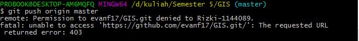

<h2 align="center">TUTORIAL MENAMBAHKAN SSH KEY, MEMBUAT REPOSITORY BARU DAN UPLOAD FILE KE GITHUB MENGGUNAKAN GITBASH</h2>

 

 

<strong>PEMBUKAAN</strong> 
Latar Belakang 
Pada kesempatan ini, kita akan bahas tentang tutorial menambahkan SSH Key, Membuat Repository baru dan mengupload file ke github melalui GitBash serta cara mengatasi problem error 403 tentang penolakan izin push oleh user lain. Dimana semua itu untuk memenuhi salah satu tugas kapita selekta. 

<strong>ISI</strong> 
Github adalah server repository git yang paling terkenal saat ini . Dengan github kita bisa membuat repository public yang bisa dilihat oleh banyak orang dan bersifat open source. 
Langkah pertama kita harus membuat akun github terlebih dahulu, disini saya sudah mempunyai akun github "evanf17"
Setelah itu kita harus instal aplikasi git(next sampai finish) 
Lalu login ke github dengan user yang kita punya dan masukan passwordnya. 
Sebelum membuat repository alangkah baiknya kita harus menambahkan SSH Key. Karena ssh key berfungsi sebagai autentifikasi antara repository dengan komputer supaya kita bisa mem-pull dan mem-push tanpa memasukan username dan password 

Untuk langkah langkah add ssh key yaitu sebagai berikut: 
a. Masuk ke halaman Account Settings yang terletak pada kanan pojok atas. 
b. Lalu klik SSH and GPG Keys dan buka gitbash yang telah diinstal di windows. 
c. Klik kanan di sembarang folder yang merupakan folder yang nanti akan dimasukan ke github, klik klik Git Bash Here. 
d. Terus ketikan ssh-keygen -t rsa -b 4096 -C "youremail.com" maksud dari your email adalah email yang dipakai pada github contohnya evanurfauziyah@gmail.com. Lalu enter. 
e. Lalu ketik cat ~/.ssh/id_rsa.pub kemudian copy ssh keynya dan paste ke dalam key ssh pada github dan masukan title atau judul SSHnya misalkan Laptop Eva. 
f. Lalu klik Add SSH Key. 
g. Nah, kita berhasil menambahkan add key. 

Langkah selanjutnya adalah membuat repository baru di akun github: 
a. klik icon + pada pojok kanan atas lalu klik new repository.  
b. Beri nama repositorynya pada field Repository Name dengan nama repository contohnya "Kapita Selekta".  
c. Lalu masukan deskripsi di field description yang nantinya isinya akan dimasukan ke dalam readme. 
d. Pilih Public dan ceklis initialize this repository with a README. 
e. Lalu klik Create Repository maka selesailah kita membuat repository. 

Kemudian, tahapan selanjutnya yaitu meng-upload file berformat markdown (.md) di folder doc/kuliah menggunakan GITBASH. 
a. Klik kanan di sembarang tempat yang nantinya akan diisikan folder doc/kuliah lalu klik Git Bash Here. 
b. Ketikan perintah git init pada gitbash. Gunanya untuk penginisialisasian. 
c. Ketikan git remote add origin "alamat repository". Alamat repository bisa dilihat pada repository yang kita buat tadi (Kapita Selekta) dengan klik Clone or Download, lalu kopi alamatnya dan pastekan ke yang tadi. 
d. Ketikan git pull origin master (menarik repository ke dalam folder tadi). Bisa dilihat nanti akan tertambahkan file readme.  
e. Kemudian buat folder doc/kuliah dengan didalamnya terdapat file pertemuan1.md 
f. kemudian cek status git dengan perintah git status. Nah disana akan terlihat bahwa kita harus meng-add folder yang kita buat ke github 
g. Ketikan add doc/ 
h. Ketikan add doc/kuliah/pertemuan1.md untuk menambahkan file .md ke dalam github 
i. Ketikan git status, disana terlihat bahwa kita bisa mengcommit file tersebut 
j. git commit -m "menambahkan file pertemuan1". Nah pada bagian ini kita bisa memberikan komentar apa yang sudah kita tambahkan/ubah/hapus. 
k. kemudian git push origin master. Gunanya untuk mengupload file tadi ke dalam repository. 

BAGAIMANA JIKA KITA MEM-PUSH ORIGIN MASTER MUNCUL PESAN ERROR 403 SEPERTI GAMBAR DI BAWAH INI?

 

 
Pesan error tersebut disebabkan ketika sebelumnya terdapat akun github lain (user lain) yang masuk/sign in di laptop kita yang menyebabkan ketika kita mem-push ijinnya ditolak oleh user lain, sehingga muncul error 403. Nah cara mengatasinya yaitu sebagai berikut: 
a. Masuk ke control panel-->User Accounts-->Credential Manager 
b. Lalu klik windows credentials 
c. Pada Generic Credentials, kita remove git:https://github.com 
d. Coba kita push ulang di gitbash maka kita akan berhasil tanpa gangguan pesan error tadi. 

Selesai sudah tutorial GitHub dari mulai add key, membuat repository baru dan mengupload file ke github dan cara mengatasi problem error403(ketika push ditolak oleh user lain).  

<strong>KESIMPULAN</strong> 
Jadi, Github adalah server repository Git open source dimana disana terdapat repository yang bersifat public (bisa dilihat oleh semua orang). 

<strong>SARAN</strong> 
Sebaiknya aplikasi ini bisa terus diimplementasikan pada kalangan pelajar sehingga mempermudah pelajar lainnya untuk mendapatkan informasi dan berbagai informasi. 

Referensi : http://wacana.siap.web.id/2014/02/pengertian-github-serta-cara-mengupload-project.html#.WAXTwPl97IU